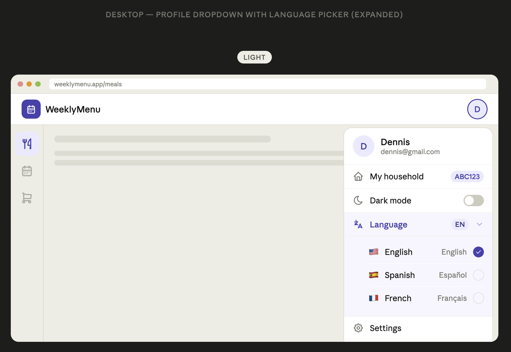
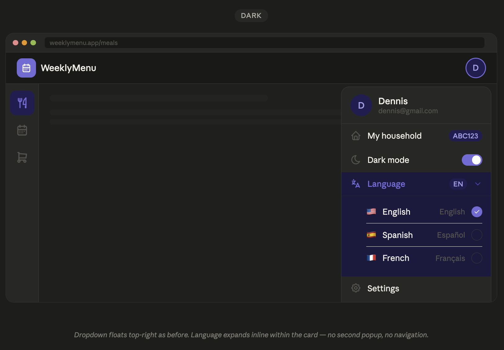
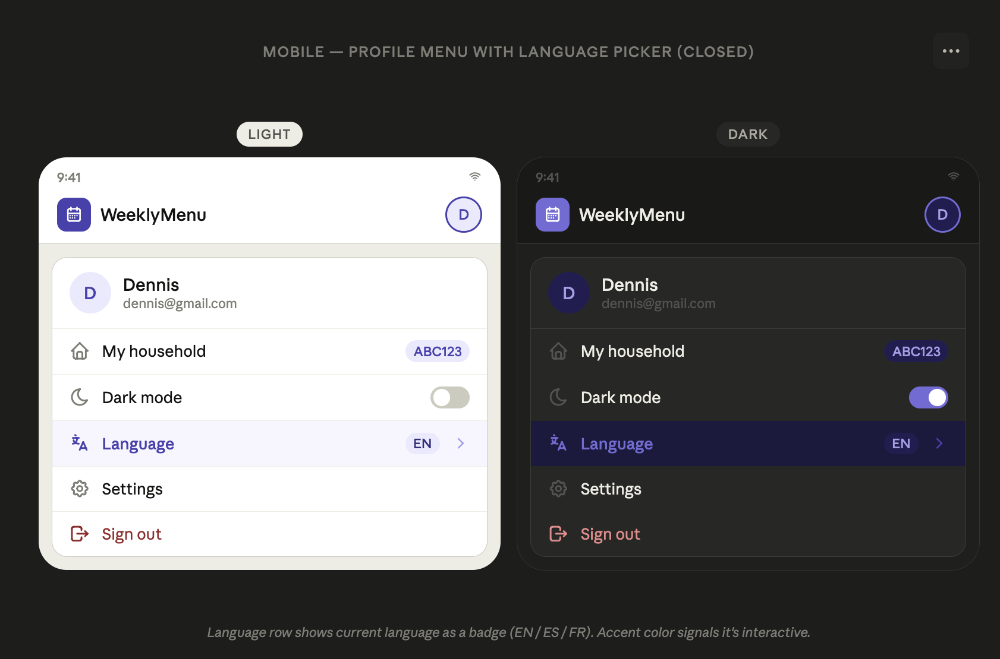
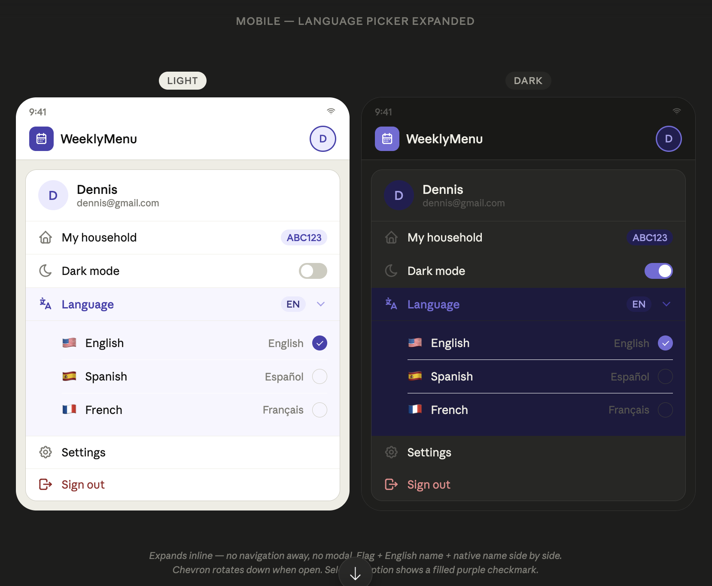

# MW-005 — Internationalization (i18n)

## Description
The internationalization feature allows users to switch the application's UI language between English, Spanish, and French. The language picker is located in the profile dropdown menu and expands inline to show available options. The system is designed to be extensible so additional languages can be added in the future with minimal effort.

## Requirements

### Supported Languages
- English (EN) — flag: 🇺🇸
- Spanish (ES) — flag: 🇪🇸
- French (FR) — flag: 🇫🇷
- System must be designed for easy addition of new languages in the future

### Default Language
- Spanish (ES) is the default for new users
- Language preference persists in `localStorage` across sessions
- On first visit (no saved preference), the app uses Spanish

### Scope of Translation
- Only UI elements are translated: labels, buttons, headings, tooltips, navigation items, and system messages
- User-entered content (meal names, ingredient names, household names, etc.) is never translated

### Language Picker Location
- Located in the profile dropdown menu, between "Dark mode" toggle and "Settings" link
- The picker expands/collapses inline within the dropdown — no navigation or modal

### Language Picker — Collapsed State
- Shows "Language" label with a text internationalization icon (e.g., `ti-language`)
- Displays current language code badge (e.g., "EN", "ES", "FR") on the right
- Chevron icon indicates it can be expanded
- The row uses accent color to signal interactivity

### Language Picker — Expanded State
- Language options expand inline below the "Language" row
- Each option shows:
  - Flag icon (left)
  - Language name in English (e.g., "Spanish")
  - Language name in its native form (e.g., "Español")
  - Checkmark icon for the currently selected language (filled purple circle)
- Selecting a language immediately applies the translation across the entire UI
- The selected language row shows a filled purple checkmark
- Clicking the "Language" row again collapses the options

### Language Persistence
- Selected language is stored in `localStorage` under a dedicated key
- On app load, read from `localStorage` and apply the saved language
- If no saved language, default to Spanish

### Translation Infrastructure
- Use a structured approach (e.g., JSON translation files or a lightweight i18n library)
- Translation keys should be organized by domain (e.g., `nav.meals`, `profile.darkMode`, `common.save`)
- All translatable strings in the codebase must use translation keys, not hardcoded text

## Mockups

### Desktop — Language Picker Expanded (Light)

### Desktop — Language Picker Expanded (Dark)

### Mobile — Language Picker Closed

### Mobile — Language Picker Expanded

